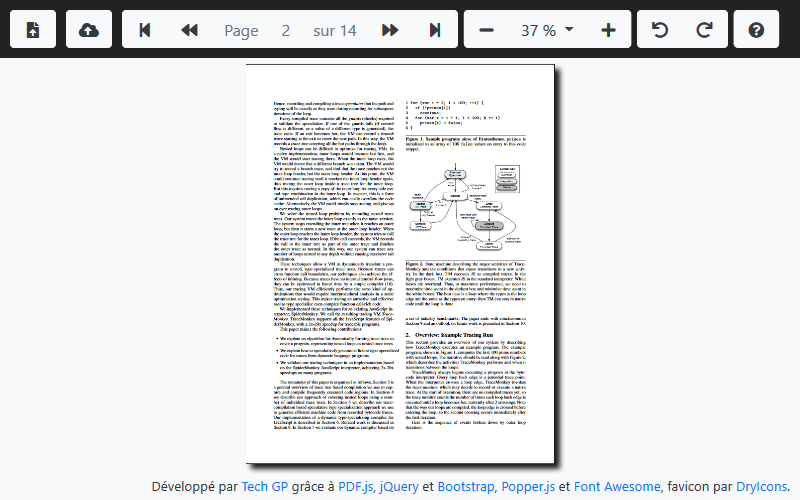

# webapps-pdf

A simple PDF viewer using [PDF.js](https://mozilla.github.io/pdf.js/) from [Mozilla](https://www.mozilla.org/fr/)

## Présentation

[Cette application](https://techgp.fr/webapps/webapps-pdf.html) écrite en HTML5, JavaScript et CSS3 vous permet de visualiser des fichiers PDF directement dans votre navigateur.

Les librairies suivantes ont été utilisées pour cette application :

- [PDF.js dist 2.0.943](https://github.com/mozilla/pdfjs-dist/releases), build de [PDF.js](https://mozilla.github.io/pdf.js/) sous licence Apache 2
- [jQuery 3.4.1](https://jquery.com/) sous licence MIT
- [Bootstrap 4.3.1](https://getbootstrap.com/) sous licence MIT
- [Popper.js 1.14.7](https://popper.js.org/) sous licence MIT
- [Font Awesome 5.7.2](https://fontawesome.com/) SIL OFL 1.1 (police) et MIT (code)
- [DryIcons](https://dryicons.com/) pour le favicon

L'application devrait fonctionner correctement est mode déconnecté grâce aux **Service Workers** sous Chrome, Firefox et [d'autres bientôt](https://caniuse.com/#search=service+worker).
Plus d'infos chez [Google](https://developers.google.com/web/fundamentals/primers/service-workers/) ou [Mozilla](https://developer.mozilla.org/en-US/docs/Web/API/Service_Worker_API/Using_Service_Workers).

## Captures d'écran

### Présentation de l'IHM

## Licence

Ce projet est distribué sous licence MIT, reproduite dans le fichier LICENSE ici présent.

## Changelog

- 2016-03-25 : première version
- 2016-05-18 : refactoring sous la forme d'un couple de composant PDFViewer / PDFToolbar
- 2016-05-18 : récupération de la langue du navigateur pour proposer le français ou l'anglais par défaut
- 2016-05-18 : correction du style CSS pour mieux aligner les composants de la barre d'outils
- 2016-05-18 : mise à jour de jQuery (2.2.2 vers 2.2.3) et PDF.js (1.3.91 vers 1.5.188)
- 2016-06-14 : récupération du texte de la page affichée pour permettre la recherche et la sélection.
- 2016-06-14 : LIMITATION : texte justifié ou avec tabulation mal dimensionné. Voir si on ne pourrait demander à PDF.js d'énumérer les éléments dessinés sur le canvas au fur et à mesure.
- 2016-06-28 : ajout du fichier LICENCE
- 2016-07-16 : mise à jour de jQuery (2.2.3 vers 2.2.4)
- 2017-05-21 : ajout de la font glyphicons à AppCache
- 2017-05-21 : mise à jour de jQuery (2.2.4 en 3.2.1), Bootstrap (3.3.6 en 3.3.7) et PDF.js (1.5.188 en 1.7.225)
- 2017-07-15 : correction de l'affichage des pages pivotées dans certains fichiers PDF 
- 2018-04-02 : personnalisation par l'URL de l'affichage de certains boutons (showOpenFile, showOpenURL et showAbout)
- 2018-04-02 : possibilité d'ouvrir automatiquement une URL via le paramètre "loadURL" (ex: loadURL=.%2Ftest%2Ftest-pdf.pdf)
- 2018-04-02 : possibilité d'afficher un bouton de retour vers une URL donnée "fromURL" ayant pour titre "fromTitle" (icône fixe)
- 2018-04-02 : possibilité de passer tous ces paramètres par le hash, par exemple btoa(JSON.stringify({loadURL: ..., fromURL: ..., ...}))
- 2018-04-02 : mise à jour de jQuery (3.2.1 en 3.3.1) et PDF.js (1.7.225 en 1.9.426)
- 2018-04-06 : utilisation des Service Workers pour la mise en cache au lieu de [Application Cache](https://developer.mozilla.org/fr/docs/Utiliser_Application_Cache)
- 2018-04-06 : retouche de la largeur des colonnes dans la fenêtre modale (bouton "?")
- 2018-04-06 : contrôle au clavier basé sur "event.key" plutôt que "event.keyCode" car plus lisible
- 2018-04-20 : correction de la hauteur du bouton "Retour" quand l'option "fromURL" est utilisée
- 2018-04-21 : réorganisation de la section "Changelog"
- 2018-04-21 : réorganisation des traces "console" du service worker
- 2018-08-24 : passage sur "Bootstrap 4" (+ Popper + FontAwesome) + refactoring pour gérer un mode "dark" (par défaut) ou "light" (?dark=false)
- 2018-08-24 : mise à jour de PDF.js (1.9.426 en 1.10.100)
- 2018-08-24 : correction du bandeau inférieur en mode clair + mise à jour des captures d'écran
- 2018-08-26 : passage des liens externes en HTTPS
- 2019-02-24 : migration vers PDF.js 2.0.943 + correction du contrôle au clavier + mise à jour de Bootstrap 4.3.1, Popper 1.14.7 et FontAwesome 5.7.2
- 2019-05-03 : mise à jour de jQuery (3.3.1 vers 3.4.1) + ajustement du contenu du cache dans le service worker
- 2019-05-03 : légères retouches pour afficher en 100% par défaut et pour ne pas générer le texte pour les pages pivotées
- 2019-05-03 : correction de la taille de l'image en ajustant le ratio des pixels CSS (96 / 72)
- 2019-05-03 : amélioration de la qualité du rendu PDF (plus de pixels dans le canvas)
