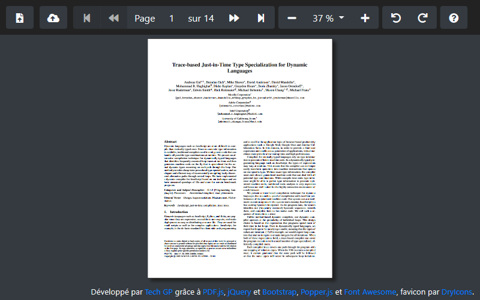

# webapps-pdf

A simple PDF viewer using [PDF.js](http://mozilla.github.io/pdf.js/) from [Mozilla](https://www.mozilla.org/fr/)

## Présentation

[Cette application](http://techgp.fr/webapps/webapps-pdf.html) écrite en HTML5, JavaScript et CSS3 vous permet de visualiser des fichiers PDF directement dans votre navigateur.

Les librairies suivantes ont été utilisées pour cette application :

- [PDF.js 1.5.188](http://mozilla.github.io/pdf.js/) sous licence Apache 2
- [jQuery 2.2.4](http://jquery.com/) sous licence MIT
- [Bootstrap 3.3.6](http://getbootstrap.com/css/) sous licence MIT

L'application est fournie avec un fichier manifest `webapps-pdf.appcache` permettant la mise en cache et l'utilisation en mode déconnecté. Plus d'info chez Mozilla [en français](https://developer.mozilla.org/fr/docs/Utiliser_Application_Cache) ou [en anglais](https://developer.mozilla.org/en-US/docs/Web/HTML/Using_the_application_cache).

NB : quand le certificat HTTPS est incorrect, la mise en cache échouera sous Chrome avec l'erreur `Manifest fetch Failed (9)`. Dans ce cas, faites les tests en HTTP et/ou utilisez un certificat valide en production.

## Captures d'écran

### Présentation de l'IHM

## Licence

Ce projet est distribué sous licence MIT, reproduite dans le fichier LICENSE ici présent.

## Changelog

2016-03-25
- première version

2016-05-18
- refactoring sous la forme d'un couple de composant PDFViewer / PDFToolbar
- récupération de la langue du navigateur pour proposer le français ou l'anglais par défaut
- correction du style CSS pour mieux aligner les composants de la barre d'outils
- mise à jour de jQuery (2.2.2 vers 2.2.3) et PDF.js (1.3.91 vers 1.5.188)

2016-06-14
- récupération du texte de la page affichée pour permettre la recherche et la sélection.
- LIMITATION : texte justifié ou avec tabulation mal dimensionné. Voir si on ne pourrait demander à PDF.js d'énumérer les éléments dessinés sur le canvas au fur et à mesure.

2016-06-28
- ajout du fichier LICENCE

2016-07-16
- mise à jour de jQuery (2.2.3 vers 2.2.4)
